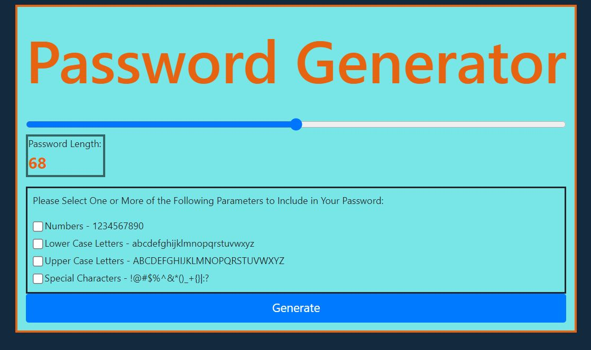

# Jacob Beach Web Developer Portfolio
# Description
This app utilizes javascript math functions to randomly generate a password from random characters within user selected parameters. 
# Usage
User the selector and checkboxes to select the parameters that need to be met for your password. 
# Credits:
Jacob Beach https://github.com/jwbeach/
